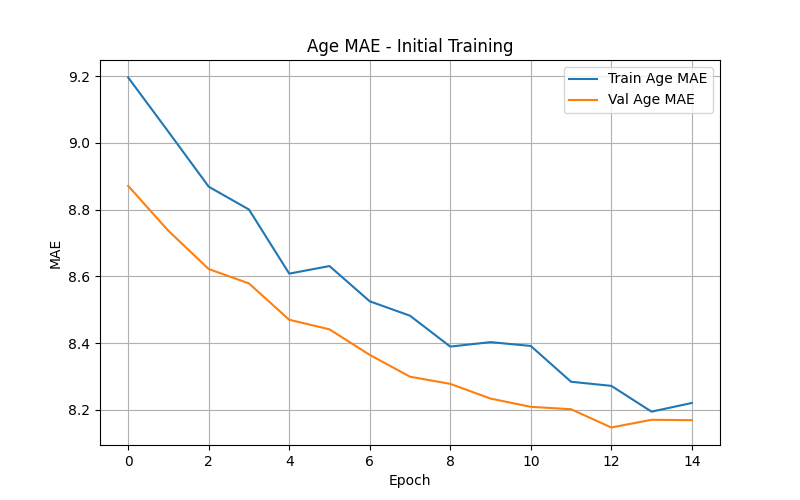
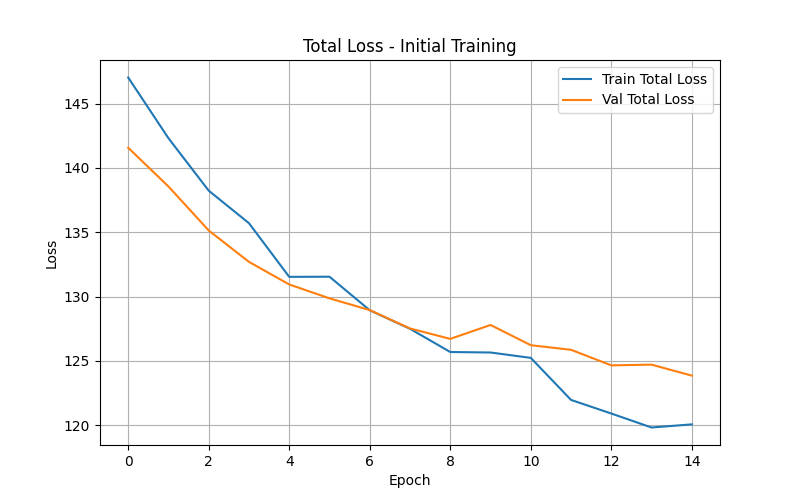
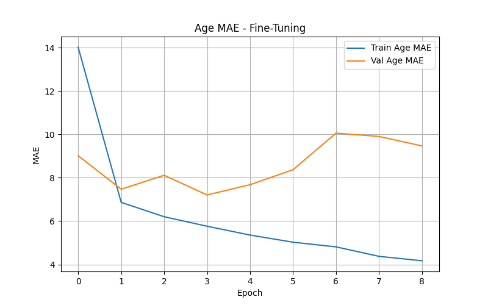
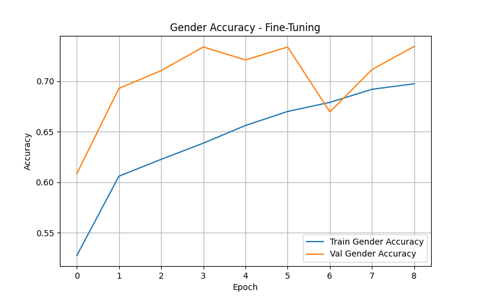
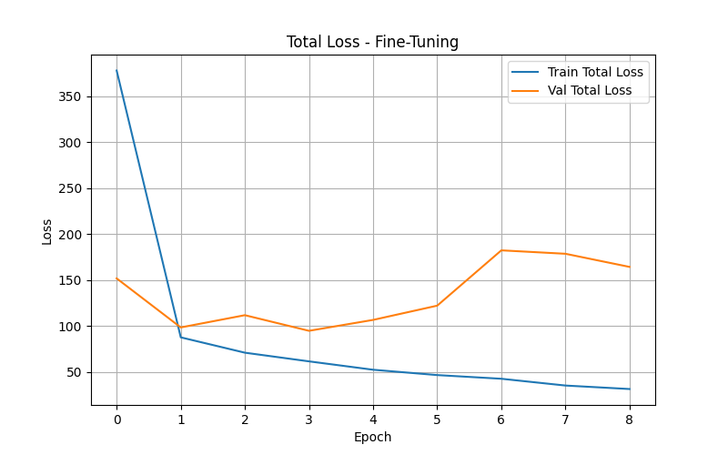

# Real-Time Age and Gender Detection

This project implements a **real-time age and gender detection system** using deep learning. The system is trained on the [UTKFace Dataset](https://www.kaggle.com/datasets/roshan81/ageutk) and can detect age and gender from your webcam in real-time using OpenCV.

---

## Dataset

- **UTKFace Dataset**: 23,168 images of faces annotated with age and gender.
- Images are resized to 128x128 and preprocessed for training.

Dataset Statistics:

- Age range: 1 - 80
- Gender distribution: 12,208 male, 10,960 female

---

## Model Architecture

We used **MobileNetV2** as the base model with pretrained ImageNet weights.

- Input: 128x128 RGB images
- Base model: MobileNetV2 (frozen initially, then fine-tuned)
- Added layers:
  - GlobalAveragePooling2D
  - Dense(128, relu)
  - Dropout(0.3)
- Two output heads:
  - Age (regression, 1 neuron)
  - Gender (binary classification, sigmoid)

### Model Class Diagram


---

## Training Process

### Phase 1: Initial Training

- Frozen base model
- Epochs: 15
- Batch size: 128
- Optimizer: Adam, lr=1e-3
- Early stopping: patience=5

#### Training Plots

- **Age MAE**

  

- **Gender Accuracy**

  

- **Total Loss**

  

### Phase 2: Fine-Tuning

- Unfrozen last 70 layers
- Epochs: 15
- Batch size: 128
- Optimizer: Adam, lr=1e-4 with ReduceLROnPlateau

#### Fine-Tuning Plots

- **Age MAE**

  

- **Gender Accuracy**

  

- **Total Loss**

  

---

## Real-Time Detection

**Requirements:**

- Python 3.8+
- TensorFlow
- OpenCV

**Run Real-Time Detection:**

- Run the "Real Time Detection.ipynb" file
- Press `q` to quit
- Predictions appear on the video frame

**Features:**

- Predicts age (regression)
- Predicts gender (binary)
- Real-time display using your webcam

---

## Model Saving

The final fine-tuned model is saved in **Keras format**:

```
saved_model/age_gender_model_final.keras
```

You can load it using:

```python
from tensorflow.keras.models import load_model
model = load_model("saved_model/age_gender_model_final.keras")
```

---

## Performance Metrics

| Metric          | Initial Training | Fine-Tuning |
| --------------- | ---------------- | ----------- |
| Age MAE         | ~8.2             | ~3.7        |
| Gender Accuracy | ~0.70            | ~0.75       |

---

## Notes

- The system does **not use bounding boxes**; it predicts on the full webcam frame.
- For better results, ensure the face occupies most of the frame.
- The plots folder contains all visualizations of training and fine-tuning metrics.

---

**References:**

- [UTKFace Dataset](https://www.kaggle.com/datasets/roshan81/ageutk)
- MobileNetV2 Paper: [Link](https://arxiv.org/abs/1801.04381)
